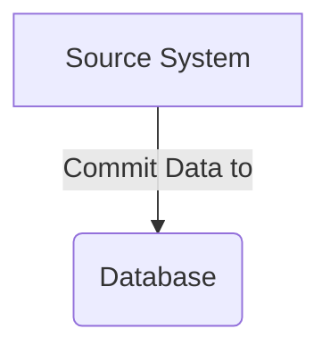
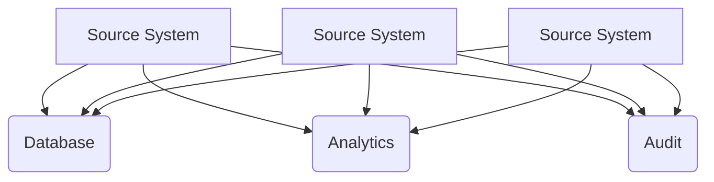
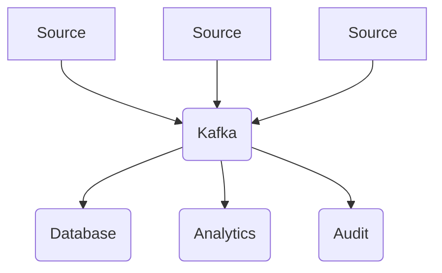
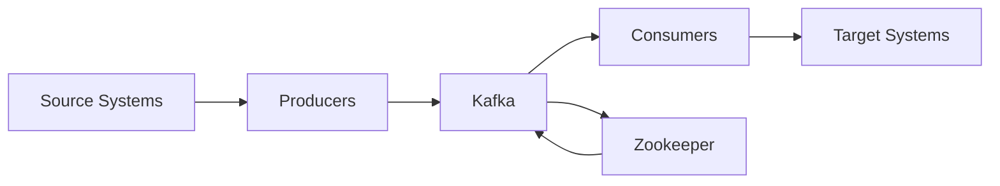

# Why Kafka?

As the applications grow and more nodes are added to each layer, the application soon turns into a mesh of connected services. In order to streamline our data flow, we introduce a [Message Oriented Middleware(MOM)](https://en.wikipedia.org/wiki/Message-oriented_middleware)

Kafka is a little more than a traditional MOM, it is a [distributed](https://en.wikipedia.org/wiki/Distributed_computing "Distributed computing") [event store](https://en.wikipedia.org/wiki/Event_store "Event store") and [stream-processing](https://en.wikipedia.org/wiki/Stream_processing) platform written in [Java](https://en.wikipedia.org/wiki/Java_(programming_language) "Java (programming language)") and [Scala](https://en.wikipedia.org/wiki/Scala_(programming_language) "Scala (programming language)"). The project aims to provide a unified, high-throughput, low-latency platform for handling real-time data feeds. Kafka can connect to external systems (for data import/export) via Kafka Connect, and provides the Kafka Streams [libraries](https://en.wikipedia.org/wiki/Library_(computing) "Library (computing)") for stream processing applications. Kafka uses a binary [TCP](https://en.wikipedia.org/wiki/Transmission_Control_Protocol "Transmission Control Protocol")-based protocol that is optimized for efficiency and relies on a "message set" abstraction that naturally groups messages together to reduce the overhead of the network roundtrip. This "leads to larger network packets, larger sequential disk operations, contiguous memory blocks which allows Kafka to turn a bursty stream of random message writes into linear writes.

Soon this system turns into

In order to avoid mesh like this we introduce Kafka. It helps you decouple your data streams.

- Distributed, resilient architecture, fault tolerant
- Horizontal Scalability
- High performance(<10ms) ~realtime

# Uses of Kafka

- Messaging System
- Activity tracking
- Gather metrics from various sources
- Application logs gatethering
- De-coupling system
- stream processing(Kafka Streams API or Spark)
- Integrations with Spark, flint, hadoop etc.

# Kafka Ecosystem

# Kafka Extended API

- Kafka Connect + kafka streams + clster

# Kafka confluent components
- proprietary compoents from confluent.
	- Schema
	- REST proxy

# Kafka core concepts and API

# Kafka in the enterprise architecture

![[Pasted image 20230501180846.png]]

# Topics and partitions

- Topic is a stream of data.
	- Similar to table in a database(no constraints. More like a bucket in NoSQL)
	- No limitations on topics.
	- Topic is identified by their name
- Topic are split into partitions
	- Each partition is ordered.
	- Each message within partition gets an incremental ID called offset.
 ![[Pasted image 20230501181201.png]]

- Offsets are relevant only for a particular partition.
- Data is kept for a limited time(default is 2 weeks).
- Data written to partition is **immutable**.
- Data is pushed to topic. The partition is assigned randomly by hash manager.
- More partitions => more parallelizations.

# Brokers
- Kafka cluster is composed of multiple brokers(nodes/servers)
- Broker has ID
- Each broker contains certain topic partitions.
- You connect to 1 broker(called bootstrap broker). This enables us to connect with the entire cluster.
![[Pasted image 20230501181546.png]]

# Topic replication factor
- Topic should have a replication factor > 1(usually 2 or 3)
- In case 1 broker goes down
![[Pasted image 20230501181701.png]]

# Partition leader
- At any time, only 1 broker can act as a leader for a given partition.
- Only leader can receive and serve data for partition.
- Other replicas will sync with the data.
![[Pasted image 20230501181856.png]]

# Producers
- Producer writes data to topics
![[Pasted image 20230501181932.png]]

## Acks
| Acks= |                                               | Data loss probability |
| ----- | --------------------------------------------- | --------------------- |
| 0     | Don't wait for acknowledgement                | Possible              |
| 1     | Producer will wait for leader acknowledgement | Possible but Limited  |
| all   | Leader + Replica acknowledgement              | Most secure.          |

## Message Keys
- Producer can choose to send a key
- Key ensures data goes to the same partition.
- This enables chronology in a distributed system.

# Consumers
- Read data from topic
- Consumes data in parallel across partitions.
![[Pasted image 20230501182517.png]]

## Consumer Groups
- Each consumer within group reads from exclusive partitions
- No. of consumers !> No. of partitions
![[Pasted image 20230501182657.png]]

## Consumer offsets
- Tells consumer where to read from
- Kafka stores the offset at which the consumer group is reading
- The offsets commit live in Kafka topic name "__consumer_offsets"
- When a consumer has processed data received on Kafka, it should commit the offsets.
- If a consumer process dies, it will be able to read back from last known location.
![[Pasted image 20230501182915.png]]

# Zookeeper
