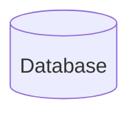

# [mermaid.js](https://mermaid.js.org/) 
`Mermaid.js` is an open source library which can be used to generate graphs in a textual format.

## Basics
```
flowchart LR
	id1[(Database)]
```


```mermaid
flowchart LR
	id1[(Database)]
```
