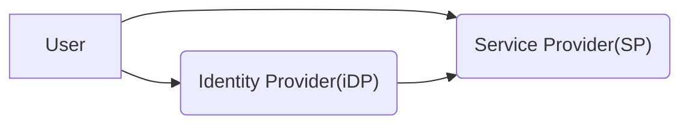

# Authentication
We use various authentication models over the internet to protect the resources online.

# REST API Authentication

> To Read
> - https://stackoverflow.blog/2021/10/06/best-practices-for-authentication-and-authorization-for-rest-apis/
> - https://mojoauth.com/blog/rest-api-authentication/
> - https://www.openidentityplatform.org/blog/stateless-vs-stateful-authentication

## Basic Authentication
The `username` and `password` are encoded in Base64(Generally). Widely used, however succeptible to attacks. Can be used over SSL and TLS channels. Doesn't allow MFA.

## Token Authentication

## API Keys
Similar to Basic authentication. Prone to similar errors. Advantages being the API keys are decoupled from the user account. So the keys can be invalidated, expired and reissued as required.

## HMAC Encryption
Use HMAC(Hash based message authentication code) to encrypt the data. Use symmetric encryption. Client and server share key to ensure the integrity of payload. The payload can be intercepted the the malicious entity can attack

## OAuth 1.0

## OAuth 2.0
Considered Gold standard for REST APIs. Supports dynamic collections of users, permission levels, scope parameters and data types. OAuth 2.0 creates secured access tokens that are refreshed periodically using a series of procedural verification protocols known as [_grant types_](https://oauth.net/2/grant-types/). The five major grant types in OAuth 2.0 are:
-   Authorization Code
-   Proof Key for Code Exchange (PKCE)
-   Client Credentials
-   Device Code
-   Refresh Token

In addition to recycling access keys, OAuth supports the [concept of scopes](https://oauth.net/2/scope/), a method of limiting an application's access to a user's account and associated credentials.

## JSON Web Tokens(JWT)
Just like the Basic Header Authentication, JWT also pass a credential in the Authorization header. The difference is that the credential is the form of the token and that it can expire

- JWTs are stateless, all the information needed to authenticate a user is within that token. They can be used without a backing store.
- Keep in mind that the token is sent every time a request is made. For enterprise apps, this could impact the data traffic size, as there would be multiple access levels, permissions and other roles to think about when implementing a solution with JWT.
- To cut down on the request payload everytime, we can use opaque properties. i.e. instead of serialized data, we just use the references. i.e. `user_id: 123`

# Single Sign On(SSO)
- Increases Security: No multiple accounts, no multiple points of failure or phishing as no login attempts.
- Increases Access: As users can login to multiple sites using just 1 identity
- Decreases admin overhead: As just 1 identity to manage.

## OpenID Connect
[OpenID Connect](https://www.techtarget.com/whatis/definition/OpenID) is an [open standard](https://opensource.com/resources/what-are-open-standards) authentication protocol built on top of OAuth 2.0. It provides a simple way for a client application -- referred to as a relying party ([RP](https://www.ibm.com/docs/en/sva/9.0.5?topic=federations-authentication-openid-connect-relying-party)) -- to validate a user's identity.
OpenID connect does the same steps as Oauth2.0 until authorization code. However, in exchange of Authorization code, OIDC gets Access Token and ID Token.
ID Token is usually JWT, carries Identification inforamtion about the user to the client.

### OAuth
OAuth 2.0 can also be used for SSO. We can create applications and use the identities from there.
OAuth is used for Authorization. It needs to be used along with OIDC to be used as SSO

## SAML(Security Assertion Markup Language)
Based upon the Extensible Markup Language (XML) format, web applications use SAML to transfer authentication data between two parties - the identity provider (IdP) and the service provider (SP).

# SOAP API Authentication

# Server-to-Server API Authentication

# Client device long term session

#